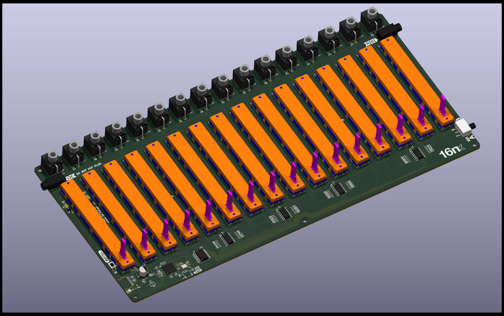

# 16nx: ECAD files

Electronics CAD and design for the 16nx faderbank, in KiCAD 8.0.4 format.

## Revision

Board revision C

## Design Notes

16nx is a redesign of the original [16n][16n] project. It has identical functionality to the original project. The changes are:

- replace Teensy 3.2 board with RP2040 microcontroller and supporting circuitry, directly on the board
- move to USB-C connector
- add more power filtering onto 5V line
- redesign analog circuitry for CV outs. Rather than running the faders at 5V and dividing down to ~3.2V for the microcontroller, 16nx runs at 3.3V everywhere, and amplifies fader values _up_ to ~5V via the MCP6004 opamps.
- move to vertical Thonkiconn jacks for CV outputs (cheaper, easier to access, easier to purchase)
- move to new horizontal jack parts for MIDI/I2C, ensuring there are no connectors on front panel (4332.2330 Schurter jacks)
- assume all SMT will be machine-placed; passives are now down to 0402, various QFN/USON parts that should be reflowed.

The only manual assembly anticipated on the board is of the through-hole components: faders, jacks, switch. Everything else is expected to be assembled via a PCBA house. The product is designed around relatively generic, off-the-shelf parts available at eg [JLC][jlc].

Gerbers are not committed to the repository; they will be supplied as part of releases.

## BOM

Bom is in `16nx-bom.csv`. It contains descriptions of parts and part numbers either at JLC or at Mouser, which is how the author built his boards. Thonkiconn are available from [Thonk][thonk].

In general, most of the passives requirements are not fussy: 1% resistors and capacitors with suitable voltage tolerance will be fine. The crystal and its capacitors are quite specifically chosen, as is the Winbond flash RAM.

The Alps faders are available in a number of resistances; the actual resistance of the fader doesn't matter, it's just being used as a voltage divider; if you can't get 10k but _can_ get 20k faders, that's fine. They **must** be linear taper, however. Do not use log/audio taper faders; you _cannot_ fix that in software. (Yes, people have asked.)

## Debug connector

The debug connector on the front of the board is a JST-SH connector breaking out ARM SWD (single-wire-debug) ready for connection to a [Pico Debug Probe][debugprobe]. This allows developers to use open-source debug tools (OpenOCD, [Cortex Debug](https://github.com/Marus/cortex-debug)) to debug the firmware in a more... pleasant manner than endless serial dumps.

## I2C pullups

Two 4.7kohm pullups are available for the I2C lines. To engage them, join the two solder jumpers at the top left of the board with a blob of solder. (You may not need these if you already have suitable pull-up impedance on your I2C lines).

## Pinouts

| GPIO | Description        |
| ---- | ------------------ |
| 2    | On board LED       |
| 4    | UART TX (MIDI OUT) |
| 10   | SDA (I2C1)         |
| 11   | SCL (I2C1)         |
| 18   | S0                 |
| 19   | S1                 |
| 20   | S2                 |
| 21   | S3                 |
| 26   | ADC0               |

## Front panels

Alongside the usual KiCAD files, this directory also includes a `panels` directory containing DXF files for top/bottom panels, and a mechanical drawing of the top panel. A schematic in PDF format is also included.

## Licensing

As per the `LICENSE.md` file, the 16nx hardware is licensed as **[Creative Commons Attribution-Share-Alike 4.0][ccsa]**.

---

[octobom]: https://octopart.com/bom-tool/unJxkzvR
[16n]: https://github.com/16n-faderbank/16n/tree/main/electronics
[jlc]: https://jlcpcb.com/
[ccsa]: https://creativecommons.org/licenses/by-sa/4.0/legalcode
[thonk]: https://thonk.co.uk/
